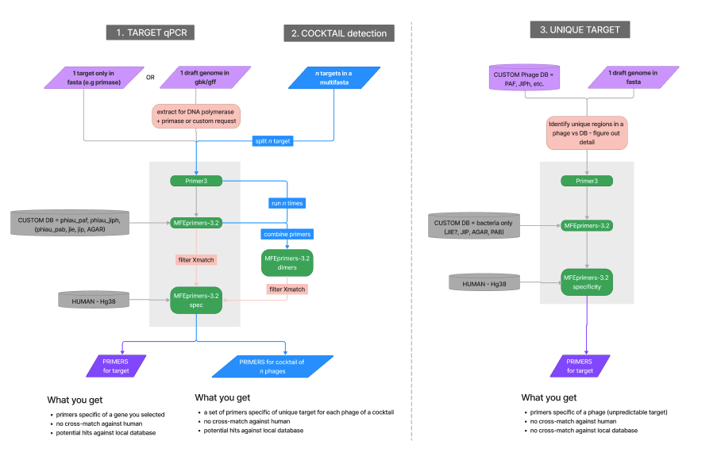

# ABSTRACT

Screening phages directly from a patient's serum using qPCR methods can be incredibly valuable in identifying phage infections and monitoring their response to treatment. To ensure the accuracy and specificity of qPCR results, it is important to carefully design primers that can detect the target phages with minimal cross-reactivity with genetic material that can be present in a serum sample, namely bacterial, viral and human DNA. 

Here we present PHAGPCR, a small pipeline built around Primer3 and MFEprimer, that can help identify suitable primer sequences and assess their specificity against local and public databases representing the phageome, microbiome and human genome. By combining these, researchers and clinicians can minimize the risk of false positive results and obtain a clearer picture of the phage populations present in a patient's serum.

Furthermore, this approach can be used to predict primers compatible with tracking multiple phages from within the same serum sample, provided that unique regions exist and suitable primers can be predicted. This can be particularly useful in cases where a combination of phages is administered to a patient for therapeutic treatment.
# USAGE

::

    usage: phagpcr.py [-h] [-f FASTA_FILE] 
                    [-o OUTPUT_DIR] 
                    [-b BLAST_DB]
                    [-hg HUMAN_GENOME] 
                    [-s SEQUENCES_DIR] 
                    [-r {1,2,3}]
                    [-nb PRIMER_NB] 
                    [-tm TM_OPTIMAL] 
                    [-sz SIZE_OPTIMAL]
                    [-k {Quantinova,Invitrogen}] 
                    [-tm2 TM_SPECIFICITY]

    Design primers using Primer3 and perform BLAST search on the designed
    primers

    optional arguments:
    -h, --help            show this help message and exit
    -f FASTA_FILE, --fasta_file FASTA_FILE
                            Path to the input FASTA file
    -o OUTPUT_DIR, --output_dir OUTPUT_DIR
                            Directory where the results will be saved
    -b BLAST_DB, --blast_db BLAST_DB
                            BLAST database for searching the primers
                            (optional)
    -hg HUMAN_GENOME, --human_genome HUMAN_GENOME
                            Screen the primers against the human genome -
                            version hg38 (True or False)(optional)
    -s SEQUENCES_DIR, --sequences_dir SEQUENCES_DIR
                            Directory containing sequences for screening
                            against the primers (optional)
    -r {1,2,3}, --runtype {1,2,3}
                            Run type for primer design: 1 = supervised
                            design providing target, 2 = cocktail
                            detection with multiplex primers, 3 =
                            unsupervised design providing phage genome
    -nb PRIMER_NB, --primer_nb PRIMER_NB
                            Nb of primer pairs to design per target
                            sequence
    -tm TM_OPTIMAL, --tm_optimal TM_OPTIMAL
                            Optimal Tm for primers
    -sz SIZE_OPTIMAL, --size_optimal SIZE_OPTIMAL
                            Optimal size for primers
    -k {Quantinova,Invitrogen}, --kit {Quantinova,Invitrogen}
                            qPCR kit used to inform Tm specification
    -tm2 TM_SPECIFICITY, --tm_specificity TM_SPECIFICITY
                            Minimum Tm to report primers-template matches
                            screened with MFEprimer

# STATUS

- STEP 1 and 2 prototype completed
- STEP3 to do

